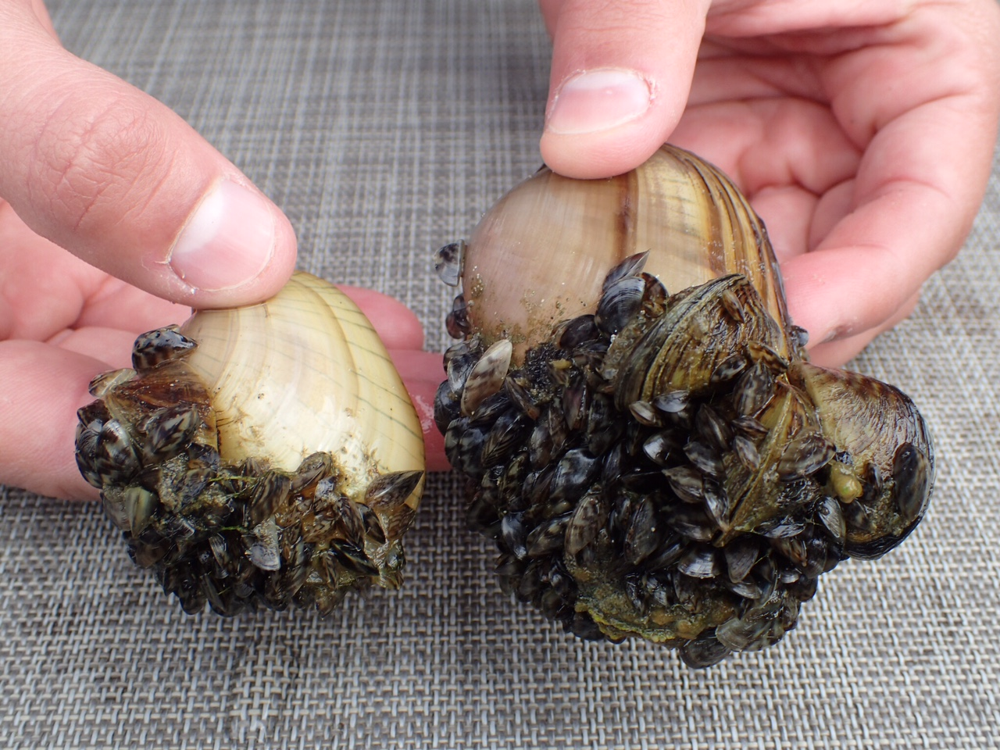
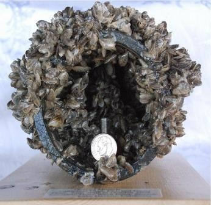
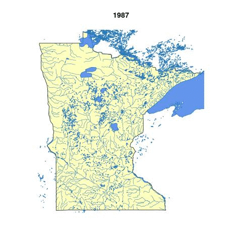
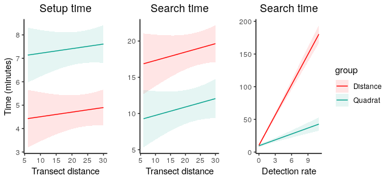

```{r, echo=F, message=F, warning=F, eval=T}
#setting up my ggplot defaults. Update with your own preferences
library(ggplot2)#plotting functions
library(ggthemes) #more themes!
library(wesanderson)
library(RColorBrewer)

theme_set(theme_tufte()) # a theme I like.
theme_update(plot.title = element_text(hjust = 0.5), 
             axis.line.x = element_line(color="black", size = 1),
             axis.line.y = element_line(color="black", size = 1),
             text=element_text(size=20),
             axis.text=element_text(size=15)) #center all titles and and axis lines
```

# Zebra mussels, a freshwater invader

.pull-left[
<br>

```{r, out.width="100%", include=TRUE, fig.cap="image: Naomi Blinick", fig.align="left", echo=FALSE}

```
]
.pull-right[
```{r, out.width="100%", include=TRUE, fig.cap="image: Mussel Prevention Program, San Luis Obispo County", fig.align="left", echo=FALSE}

```
]

???
It has been documented that zms can alter their environment by increasing ammonium and nitrate
There have been a number of documented changes in water chemistry, water clarity 
Decreases in plankton production mean less food for fish
economic impacts
The photo on the right
The zms can occur at extremely high densities growing over each other in like cancerous cells. They can reag such high densities can clog intake pipes for industrial applications. Congressional researchers estimated that an infestation of zebra mussel in the Great Lakes cost the power industry alone $3.1 billion in the 1993-1999 period

---
# Spread through Central U.S.

<br>

```{r, echo=F, fig.align="center"}

```


???
First detected in 1989 in Lake Superior. Mechanisms of spread natural can be natural dispersal between connected waterways (rivers). 
However, human aided dispersal is  also an important factor in their spread. adults can attach to boats, nets, docks, etc. 
larval zm’s can survive in any bits of water that are not properly drained in boats

---
# Slow-fast tradeoffs in surveys

<br>

```{r, out.width = '90%', fig.align = "center", echo=F}
 
```


---
# Optimal foraging theory

```{r, out.width="60%", include=TRUE, fig.cap=c("From MacArthur & Pianka (1966)"), fig.align="center", echo=FALSE}
knitr::include_graphics("../Figures/MacArthurPianka1963.png")
```

???

MacArthur and Pianka asked how many species should a predator consume for a set of prey items that are profitibale? Delta S is the mean search time. Delta P is the mean pursuit time (handling time). Considered 

---
# Survey designs

```{r, out.width = '70%',fig.align="center", echo=F}
knitr::include_graphics("../Figures/DistanceQuadratSampling.png") #show detection functions
```

---
# The time budget approach

$$T = \underbrace{N\, \tau_0}_{\text{Setup time} } + \underbrace{N\, \tau_S}_{\text{Search time} } + \underbrace{N\, E[X] \, \tau_H}_{\text{Handling time}}$$

Travel time between transects is also a factor but we will ignore it.

<br>

```{r, out.width="80%", include=TRUE, fig.cap="Bill Watterson", fig.align="center", echo=FALSE}

```

---
# The importance of search time

<br>

### **Search time** determines:

<br>

- The probability of detection $P = \frac{\tau_S}{\tau_S + \beta}$

- The expected number of detections on a transect $E[X] = P\, D\, a$

- The number of transects surveyed $E[N]=\frac{T}{\tau_0 + \tau_S + E[X] \tau_H}$.


---
# The time budget data

```{r, out.width="100%", include=TRUE, fig.align="center", echo=FALSE}

```

---
# Which survey strategy is superior?

```{r, out.width="80%", include=TRUE, fig.align="center", echo=FALSE}

```


---
# Survey results

```{r, out.width = '100%',fig.align="center", echo=F}
knitr::include_graphics("../Figures/DensityEstimate2.png") 
#show detection functions
```

---
# Optimization of a search strategy

<br>

Optimal surveys should minimize the variance of the estimated density.

$$
\begin{align}
\mathrm{Var} (\hat{D})  &= \text{Variation in counts} + \text {Variation in detection}\\
 &= \hat{D}^2 \left(  \frac{\mathrm{E[N]} \mathrm{Var}(X|P) + \mathrm{Var}(N)\mathrm{E}[X|P]^2}{X^2} +  \frac{\mathrm{var}(\hat{P})}{\hat{P}^2} \right)
\end{align}
$$

<br>

Optimization condition
$$\frac{d\, \mathrm{Var} (\hat{D})}{ d\, \tau_S}\Bigr|_{\tau_{S^*}} =0$$


---
# How to perform an optimal distance survey?

```{r, out.width="60%", include=TRUE, fig.align="center", echo=FALSE}

```

* Speed up with higher densities

* Speed up with increases in spatial heterogeneity


---
# Summary

* Linked surveyor behavior to detection probabilities
  * Still missing some variance contributions
 
  
* Lower handling time leads to superior behavior of quadrats at high densities

  
* Found cost of missing rare individuals is high
  

* How to precisely control searcher effort?

---
# Acknowledgements

.pull-left[
John Fieberg

Michael McCartney

Naomi Blinick

Leslie  Schroeder

Sarah Baker

Aislyn Keyes

Austin Hilding

<br>


]

.pull-right[
Kylie Cattoor

Keegan Lund

Alana Danieu

Nick Fredrickson

Emily Kaegi

Clara Livingston

Katie St. Clair

<br> 


]


