```{r setup, include=FALSE}
knitr::opts_chunk$set(echo = FALSE)
```

<!---
## Aloha

```{r, out.width = '75%', fig.align='center', echo=F}

```
--->


## Objectives


<div style="float: left; width: 65%;">

Develop recommendations for underwater survey methods for monitoring zebra mussels in recently infested lakes:

> - Estimate density
> - Distribution within the lake
> - Quantify effects of treatments and impacts that depend on density
  > + $\Rightarrow$ requires comparisons over time and space

</div>

<div style="float: right; width: 30%;">
```{r, out.width = '70%', fig.align = "center", echo=F, fig.cap="image: Naomi Blinick"}
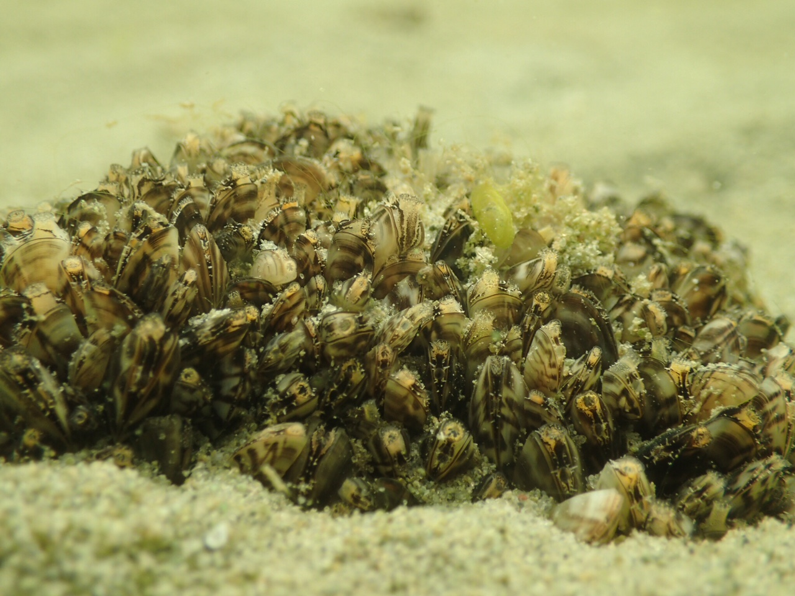 
```
</div>


##  Why Focus on Newly Infested Lakes?

At **high** densities management options are limited

However, at **low** densities there are management options depending on:

- the spatial distribution of the population
- the rate of increase of the population

image: https://www.mprnews.org/story/2015/10/23/zebra-mussels

```{r, out.width = "400px", fig.align = "right", echo=F, fig.cap=""}
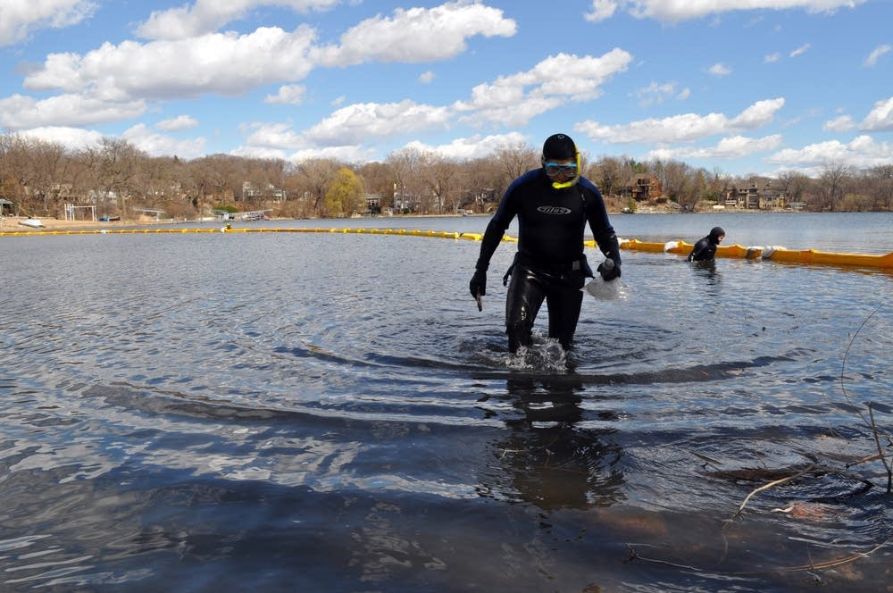
```

 

## Existing survey designs
<div class="columns-2">
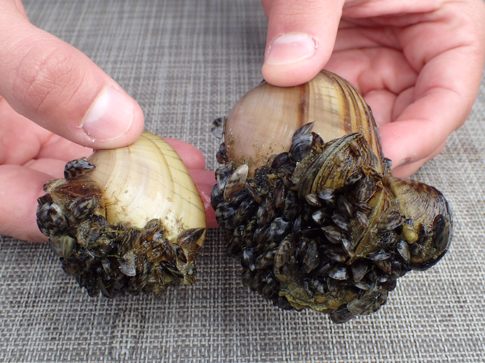
\
image: Naomi Blinick

\

* Discovery in low densities (**timed searches**)
* High-densities (**quadrat surveys**)
</div>

\

**But what about designs for low to moderate densities?**

<div class="notes">
There are a number of different ways that biologists count critters in the field. For our purposes we are interested in surveying lakes with low enough densities that simply jumping in the lake and looking that the bottom will not likely yield useful data. Therefore we are designing our study around transects, which allow our scuba-diving field scientists to spend enough time underwater to obtain estimates. 
We will have a demonstration at the end of this talk describing this process in more detail, but for now you can think of it as a line where the scientist counts the number of organisms on either side. 
</div>


##  Important Considerations

<div style="float: left; width: 50%;">

- We can't sample entire lakes!

  > + must infer density after sampling only part of a lake
  > + use random or systematic sampling
  
- We may not detect all mussels in the area we sample

  > + use methods that can correct for imperfect detection

</div>
 
 

<div style="float: right; width: 50%;">
```{r, out.width="50%", fig.align = "right", echo=F}
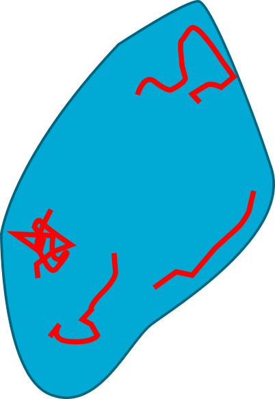
```
</div>


## Important Considerations

<div style="float: left; width: 60%;">
<div align="center">
<iframe src="https://drive.google.com/file/d/0B3jJ61PiYVI-ck84OHloS25sNG8/preview" width="333.33" height="250"></iframe>.
</div>
</div>

<div style="float: right; width: 35%;">

Our ability to detect mussels may depend on

> -  water clarity, presence of plants, ...
> -  the diver
</div>


# Year 1: Surveys Using Distance Sampling

## Year 1 field crew
```{r, out.width = "600px", fig.align = "center", echo=F, fig.cap="image: Naomi Blinick"}
library("vembedr")
knitr::include_graphics("../Figures/FieldCrew.jpg")
```


## Transect sampling  


```{r, out.width="40%", fig.align = "center", echo=F}
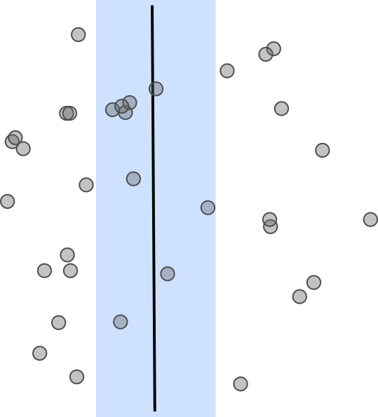
```


## Transect Sampling + Distance Sampling 

```{r, out.width="40%", fig.align = "center", echo=F}

```
Allows us to *and account for imperfect detection*.

<!---
## Extra information yields detection estimates

<div class="columns-2">
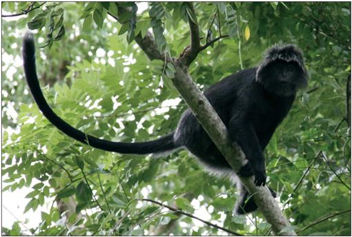

<font size="4"> Leca, J., N. Gunst, A. Rompis, G. Soma, I. G. A. Arta Putra, and I. N. Wandia (2013) *Population Density and Abundance of Ebony Leaf Monkeys (Trachypithecus auratus) in West Bali National Park, Indonesia*, Primate Conservation 26(1), 133-144. </font> 


\

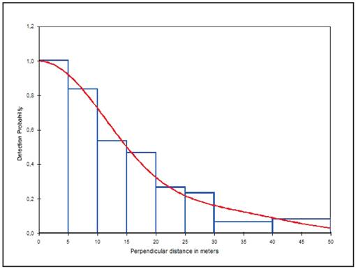
</div>

--->

## Important assumptions in conventional distance sampling

<div style="float: left; width: 30%;">
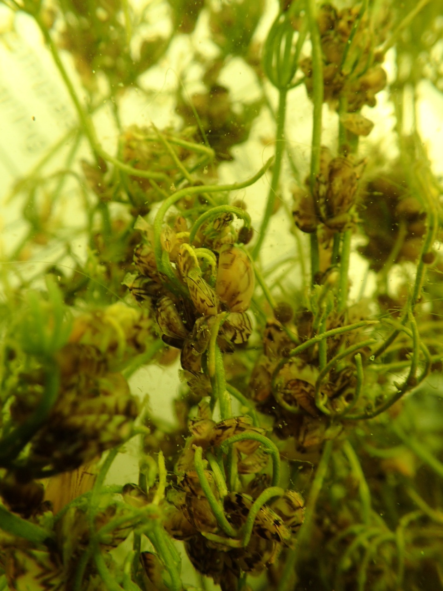
</div>


<div style="float: right; width: 65%;">

* Densities are uniform with respect to distance from the transect line (guaranteed with random placement of transects)
* Detection on the transect line is *perfect*
* Animals do not move before detection
* Measurements are exact
</div>


## Extra information yields detection estimates

<div class="columns-2">


<font size="4"> Leca, J., N. Gunst, A. Rompis, G. Soma, I. G. A. Arta Putra, and I. N. Wandia (2013) *Population Density and Abundance of Ebony Leaf Monkeys (Trachypithecus auratus) in West Bali National Park, Indonesia*, Primate Conservation 26(1), 133-144. </font> 


\


</div>

## Lake Sylvia

```{r, out.width = '90%', echo=F}
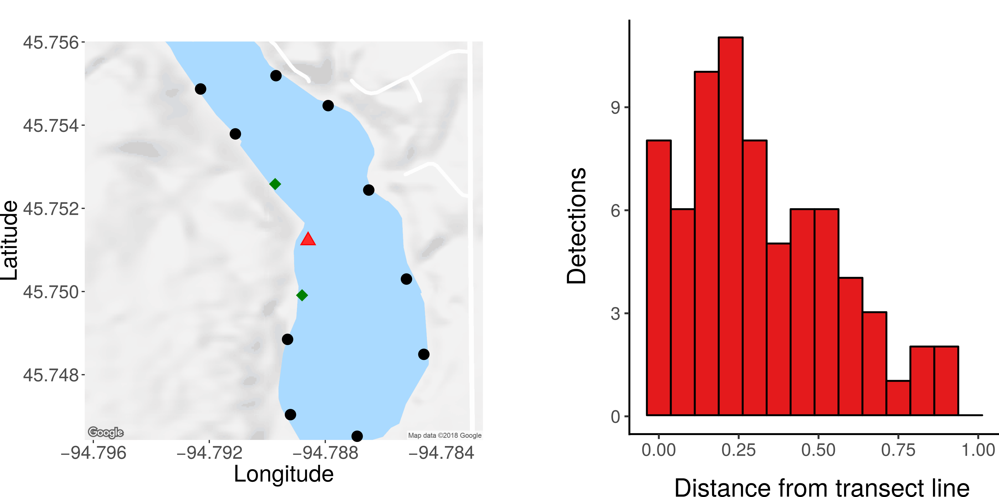 #show sylvia map and histogram
```
 
##  Lake Burgan

```{r, out.width = '90%', echo=F}
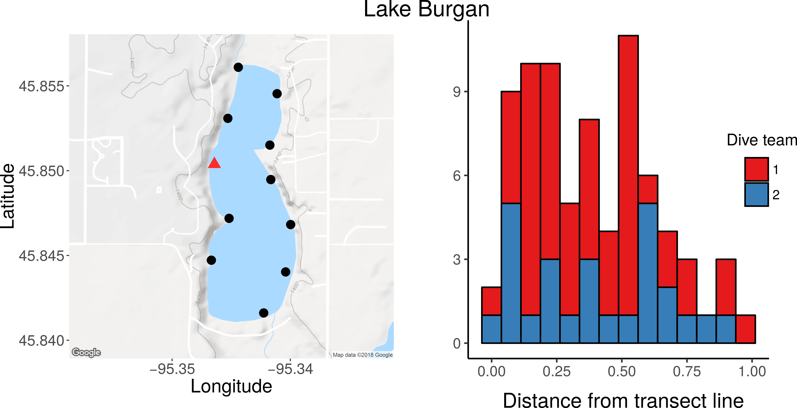 #show Burgan map and histogram
```

<!---
## Detection Probabilities on the Transect Line

Second Observer:

* Allows for a mark-recapture component to the distance survey. 
  + First diver surveys, followed by a second diver 
* Determining which mussels are detected by one or both observers allows us to estimate density on the transect line. 
--->


## Estimating detection with two observers

<div class="columns-2">
```{r, out.width="70%", fig.align = "center", echo=F}
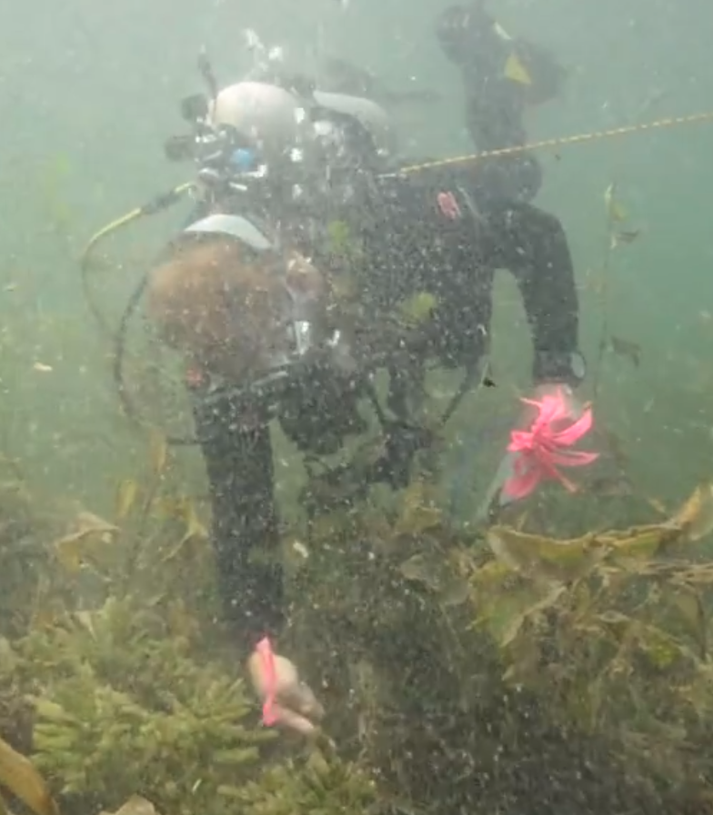
```

* First observer marks each detected cluster
* Second observer looks for new clusters
* New detections inform our estimate of detection probability

</div>


<div class="notes">
This is not exactly how we did things in year 1 (we had divers survey independently), but it is the method we used in year 2 and is the method we recommend
</div>

## Importance of Accounting for Detection 

<div style="float: left; width: 50%;">
```{r, out.width = '70%', fig.align = "center", echo=F, fig.cap="image: Naomi Blinick"}
 
```

</div>

<div style="float: right; width: 50%;">

Estimated density without detection $0.08$ mussels/m$^2$.

Estimated density without detection $0.25$ $(0.07)$ mussels/m$^2$ .

</div>

\

Correcting for imperfect detection lead to a 3-fold increase in our estimate of density!
<!---
## Lessons from Year 1

* Detection on the transect line is far from perfect
* Need to use double-observer surveys
  + Significant heterogeneity *between* observers
* Do not need to stratify effort
* Dive surveys are hard

```{r, out.width = '60%', fig.align = "center", echo=F, fig.cap="image: Aislyn Keyes"}
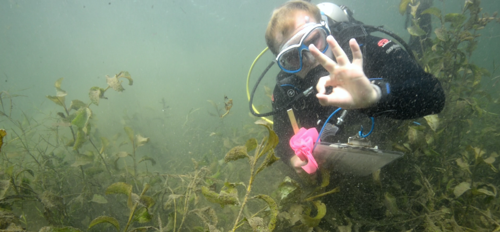 
```
--->

# Year 2: Comparing Multiple Survey Designs

## Dive team

```{r, out.width = '90%', echo=F}
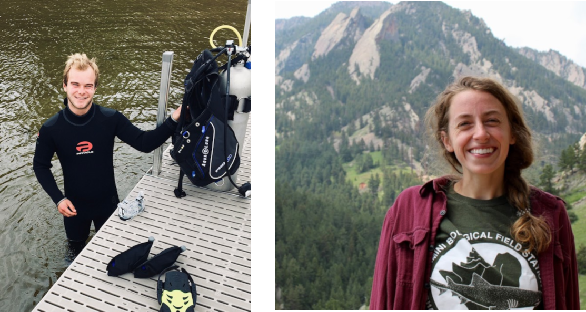 #show Burgan map and histogram
```


## How do distance surveys compare to quadrat surveys?

By surveying smaller quadrats, we may be able to detect all mussels in the surveyed area.

*When* might quadrat designs be preferable?
\

```{r, out.width = '60%', echo=F, fig.cap="image: Jake Ferguson", fig.align='center'}
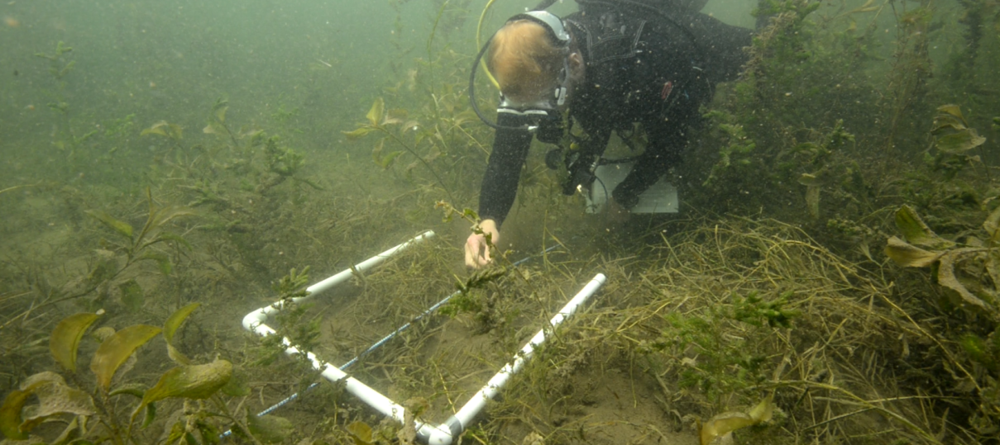 
```


## Given a *fixed* amount of time, which method performs best?


```{r, out.width = '60%',fig.align="center", echo=F}
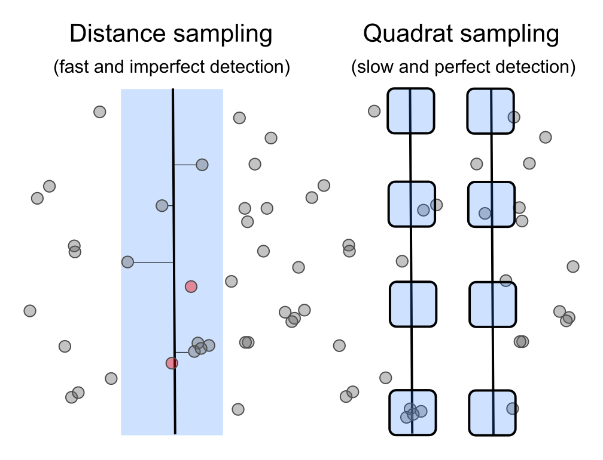 #show detection functions
```
<!---
```{r, out.width="90%", fig.align = "center", echo=F}
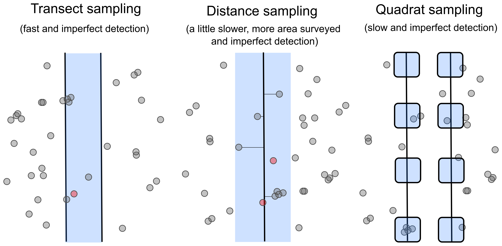
```

JAKE:  Ideally, add transect sampling too (but correct quandrat sampling to say "slow and perfect detection")
--->

## We compared designs across densities

\

```{r, out.width = '95%',fig.align="center", echo=F}
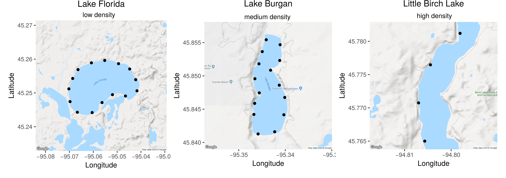
``` 

<!---
## Two sources of variance: counts and detection

```{r, out.width = '80%',fig.align="center", echo=F}
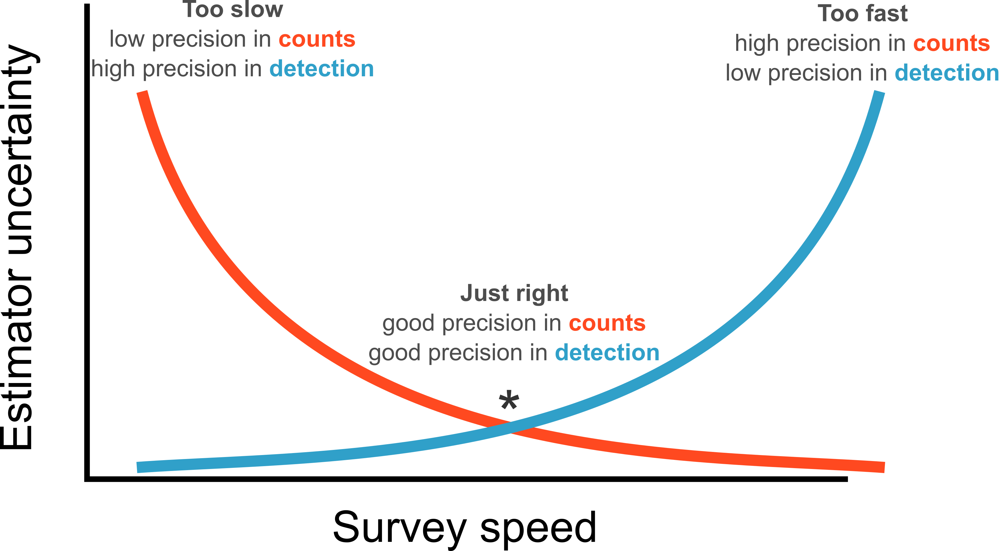 #show detection functions
```

--->

<!---
## Detection probability estimates
\

<div class="columns-2">
```{r, out.width="100%", fig.align = "center", echo=F}
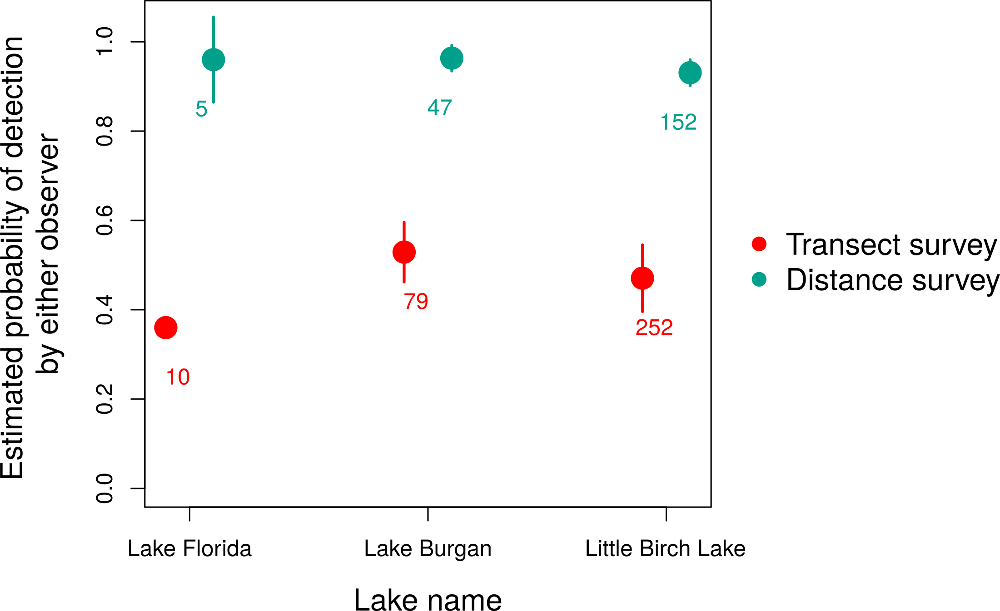
```

\
\

* Detection estimates were consistent across the 3 lakes
  + *Transect surveys*: with 2 observers, detection probability was **> 90\%**.
  + *Distance surveys*: with 2 observers, detection probability was around **50\%**

JAKE:  the legend here appears to be backwards.
</div>

## Density estimates
```{r, out.width="70%", fig.align = "center", echo=F}
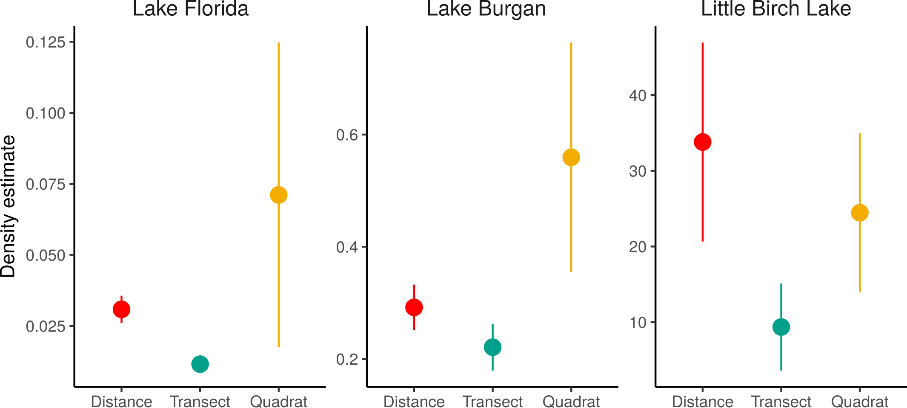
```

* Estimates from transect surveys were consistently lower
* Variance of Quadrat estimates was highest at low to medium density

JAKE: Can you add a legend to the plot?
--->


## Results

```{r, out.width = '90%',fig.align="center", echo=F}
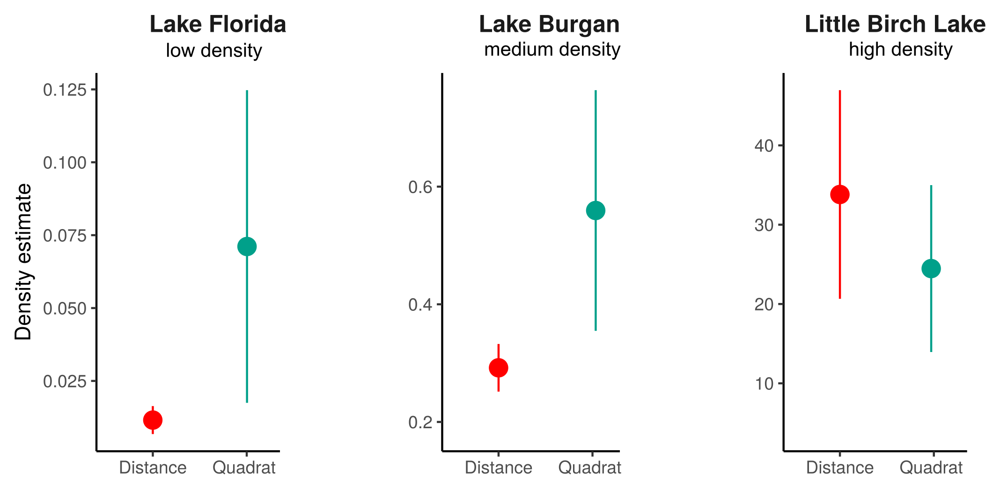 #show detection functions
```

## Lessons from Year 2

* Distance sampling is preferable at low to moderate densities

* Quadrat sampling may be preferable at high densities (*when*?)
\

```{r, out.width = '70%', fig.align = "center", echo=F, fig.cap="image: Aislyn Keyes"}
 
```


## Generalizing these results 


```{r, out.width = '80%',fig.align="center", echo=F}
knitr::include_graphics("../Figures/TimeBudgetEstimates.png")
```

## Ongoing Work 

<div class="columns-2">
- Using simulations (work with Dr. Katie St. Clair at Carleton College)

```{r, out.width = '40%', fig.align='center', echo=F}
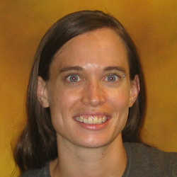
```
\
\


- Analytical approach that shares similarities with models used to determine optimal foraging behaviors (Dr. Jake Ferguson, University of Hawaii)

```{r, out.width = '60%', fig.align='center', echo=F}

```
</div>


# Additional Products

## Training video

```{r, out.width = '70%', fig.align = "center", echo=F}
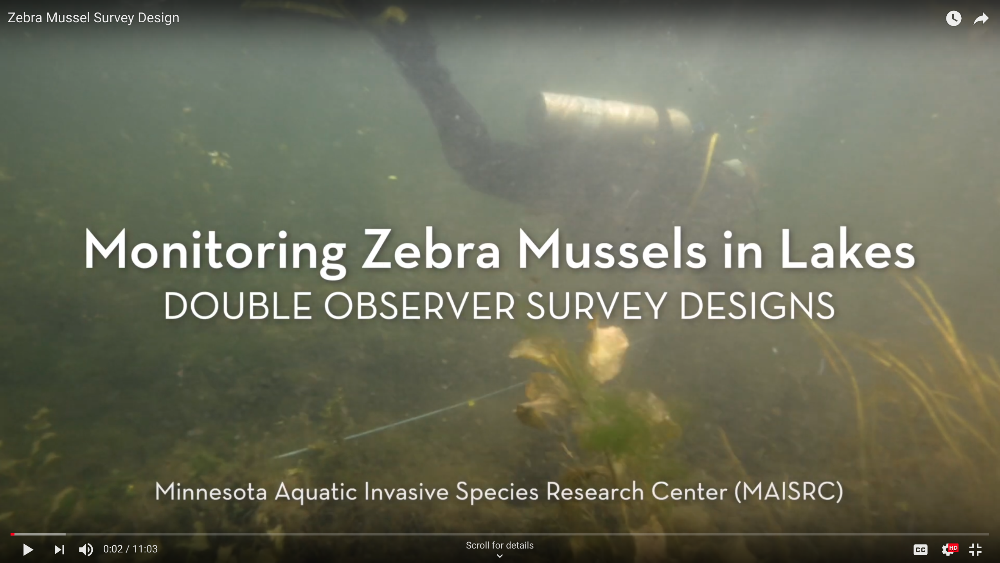 #show Burgan map and histogram
```
<center>
Training Video: https://youtu.be/E3ui8SVeBC0

## Resources

<div style="float: left; width: 50%;">
Project web site: https://zebramusselsurveys.netlify.com/

```{r, out.width = '70%',  fig.keep="last", fig.show='hold',echo=F}
knitr::include_graphics("../Figures/web.jpg") 
```
</div>

<div style="float: right; width: 50%;">

- Data Sheets
- Google Forms for data entry
- Presentations and News
- Analysis tutorial: https://zebramusselsurveys.netlify.com/tutorial

</div>


## Acknowledgements
<div class="columns-2">

Jake Ferguson

Michael McCartney

Naomi Blinick

Leslie  Schroeder

Sarah Baker

Aislyn Keyes

Austin Hilding

Kylie Cattoor

Keegan Lund


</div>


## Quadrat sampling error

```{r, out.width = '50%',fig.align="center", echo=F}
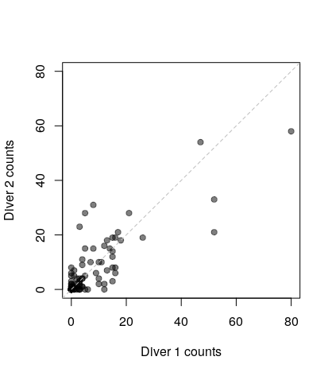
```


<!---
# The spread of zebra mussels


## The Minnesota invasion

<div class="centered">
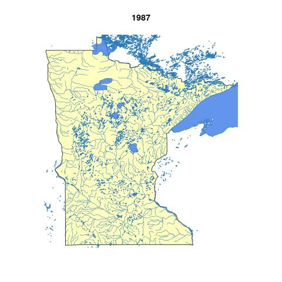
</div>

<div class="notes">
First detected in 1989 in Lake Superior. Mechanisms of spread natural can be natural dispersal between connected waterways (rivers). 
However, human aided dispersal is  also an important factor in their spread. adults can attach to boats, nets, docks, etc. 
larval zm’s can survive in any bits of water that are not properly drained in boats
</div>

## Impacts of the mussel invasion

<div class="columns-2">
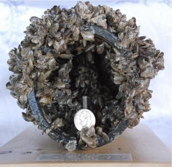
\
<font size="3"> image: Mussel Prevention Program, San Luis Obispo County </font>
</span>

- Changes in water chemistry
- Decreases in plankton densities
    + Decreases in native mussel populations
    + Changes in water clarity
    + Increases in plant cover
- Economic impacts on power industry
    
</div>


<div class="notes">
t has been documented that zms can alter their environment by increasing ammonium and nitrate
There have been a number of documented changes in water chemistry, water clarity 
Decreases in plankton production mean less food for fish

economic impacts
The photo on the right
The zms can occur at extremely high densities growing over each other in like cancerous cells. They can reag such high densities can clog intake pipes for industrial applications. Congressional researchers estimated that an infestation of zebra mussel in the Great Lakes cost the power industry alone $3.1 billion in the 1993-1999 period
</div>


--->


