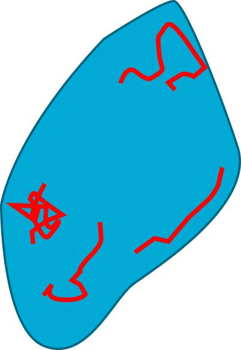
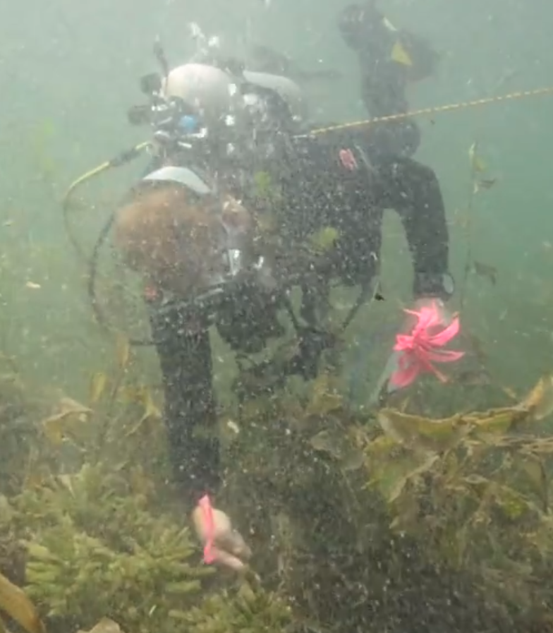

<!--
John's outline
I. Introduction (objectives) 1 or 2 slides on why its important to collect data using statistically rigorous sampling designs (to be able to generalize to the whole lake, repeatability, comparisons over space/time that account for differences in detection/observers).
II. Methods:   2- 3 slides, mainly highlighting methods from year 2 sampling effort:  2 divers using SCUBA, role of primary/secondary diver,  process of marking mussels, different designs (double observer, quadrat)
#III. Analysis: maybe 1 slide covering the basics of distance sampling (e.g., perhaps using the "Pooled Detections" plot from the vignette). 
IV. Main findings: detection rates were low (< 0.4), depended on distance from transect, observer, plant cover, sampling efficiencies versus method (quadrat vs. double-observer methods); we should also provide estimates and SEs for the lakes we sampled.
V. Recommendations:  use 2 divers, transects vs. quadrats depending on density
VI. Where to find more: briefly highlight website, tutorial, google forms, training video and provide links.
--> 

```{r setup, include=FALSE}
knitr::opts_chunk$set(echo = FALSE)
```


# Introduction

## Why have a survey design?

```{r, out.width="40%", fig.align = "center", echo=F}

```

This type of survey can be useful for the discovery of zebra mussels

## Transect sampling is one approach to cover area quickly 

```{r, out.width="40%", fig.align = "center", echo=F}
knitr::include_graphics("../Figures/LakeDesign.png")
```

A formal design controls effort and area surveyed so we can estimate density.

# Methods

## Three survey designs to explore sampling tradeoffs
```{r, out.width="90%", fig.align = "center", echo=F}
knitr::include_graphics("../Figures/TransectDistanceQuadratSampling.png")
```

## Estimating detection with two observers
<div class="columns-2">
```{r, out.width="70%", fig.align = "center", echo=F}

```

* First observer marks each detected cluster
* Second observer looks for new clusters
* New detections inform our estimate of detection probability

</div>

## Using the additional information from distance surveys
```{r, out.width="60%", fig.align = "center", echo=F}

```

## We compared designs across densities

\

```{r, out.width = '95%',fig.align="center", echo=F}
knitr::include_graphics("../Figures/Season2Lakes.png")
``` 


# Main Findings

## Detection probability estimates
\

<div class="columns-2">
```{r, out.width="100%", fig.align = "center", echo=F}
knitr::include_graphics("../Figures/DetectionEstimates.png")
```

\
\

* Detection estimates were consistent between lakes
* In transect surveys the detection probability by either observer detecting the zebra mussel was **> 90\%**.
* In distance surveys detection probability by either observer was around **50\%**

</div>

## Density estimates
```{r, out.width="70%", fig.align = "center", echo=F}
knitr::include_graphics("../Figures/DensityEstimates.png")
```

* Estimates from transect surveys were consistently low
* Variance of Quadrat estimates was highest at low to medium density

## Recommendations


<div class="columns-2">
```{r, out.width="95%", fig.align = "center", echo=F}

```

\
\

* Apply **distance surveys** with two divers at **low to moderate** densities
* **Quadrat surveys** at **high** densities

</div>

## Acknowledgements
<div class="columns-2">

Jake Ferguson

Michael McCartney

Naomi Blinick

Leslie  Schroeder

Sarah Baker

Aislyn Keyes

Austin Hilding

Kylie Cattoor

Keegan Lund


</div>
## Other resources


