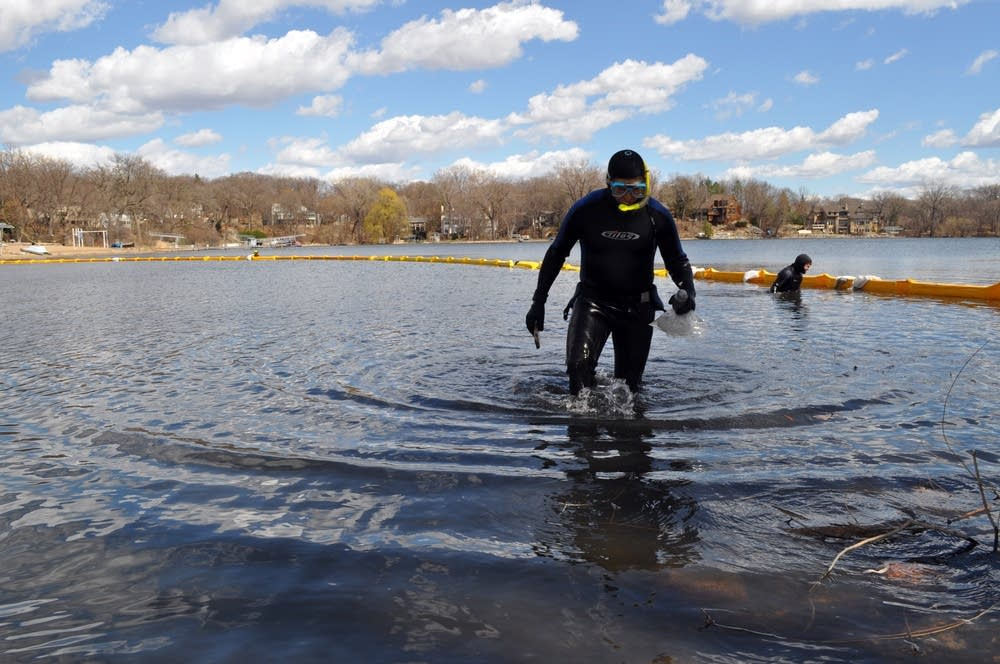
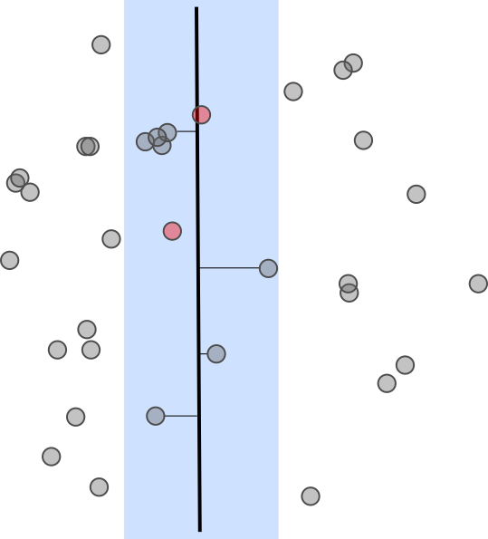
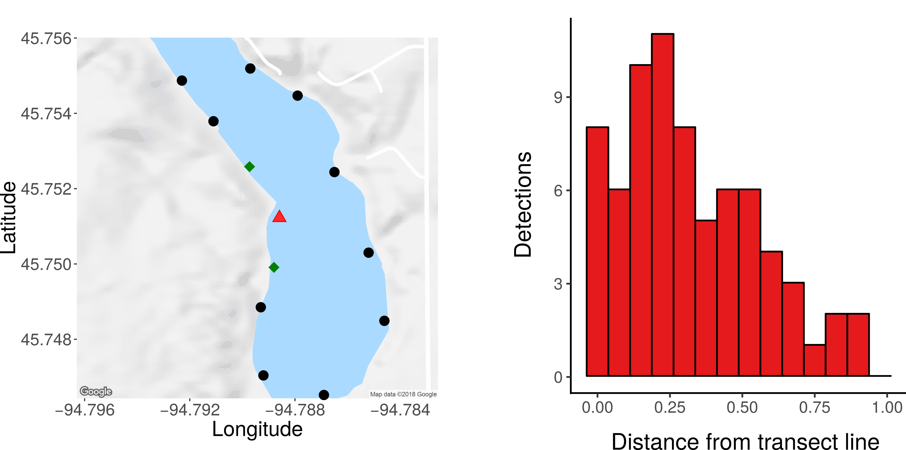
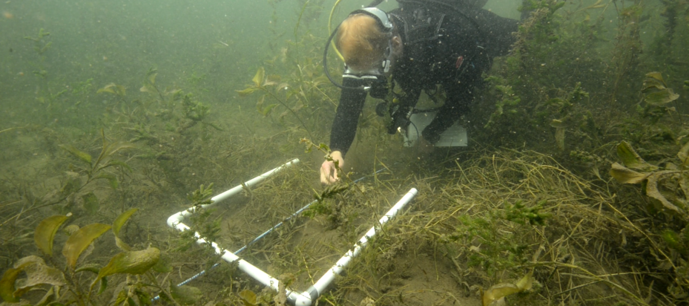
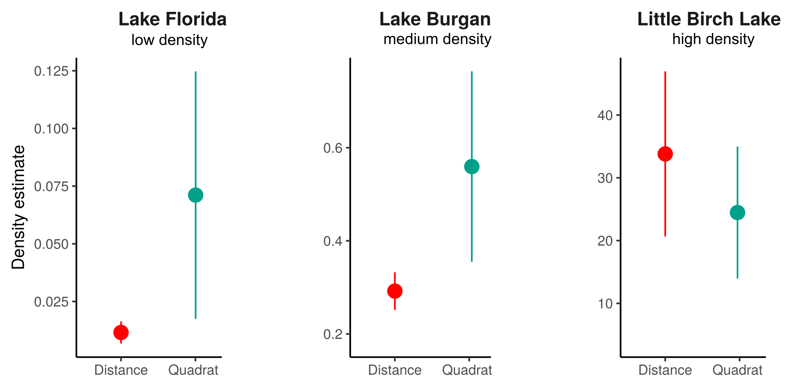
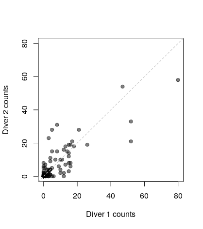

```{r setup, include=FALSE}
knitr::opts_chunk$set(echo = FALSE)
```

## Aloha

```{r, out.width = '75%', fig.align='center', echo=F}

```


# The spread of zebra mussels
<div class="notes">
Hi thanks for coming, today I get to talk to you about counting zebra mussels. 
We are going to talk about why something that seems very simple, going out to a lake and counting ZM’s can be improved by using some ideas from statistics to design these surveys to make sure that we sample efficiently
</div>

## The Minnesota invasion

<div class="centered">

</div>

<div class="notes">
First detected in 1989 in Lake Superior. Mechanisms of spread natural can be natural dispersal between connected waterways (rivers). 
However, human aided dispersal is  also an important factor in their spread. adults can attach to boats, nets, docks, etc. 
larval zm’s can survive in any bits of water that are not properly drained in boats
</div>

## Impacts of the mussel invasion

<div class="columns-2">

\
<font size="3"> image: Mussel Prevention Program, San Luis Obispo County </font>
</span>

- Changes in water chemistry
- Decreases in plankton densities
    + Decreases in native mussel populations
    + Changes in water clarity
    + Increases in plant cover
- Economic impacts on power industry
    
</div>


<div class="notes">
t has been documented that zms can alter their environment by increasing ammonium and nitrate
There have been a number of documented changes in water chemistry, water clarity 
Decreases in plankton production mean less food for fish

economic impacts
The photo on the right
The zms can occur at extremely high densities growing over each other in like cancerous cells. They can reag such high densities can clog intake pipes for industrial applications. Congressional researchers estimated that an infestation of zebra mussel in the Great Lakes cost the power industry alone $3.1 billion in the 1993-1999 period
</div>

## Managing the invasion

At **high** densities management options are limited

However, at **low** densities there are management options depending on:

- the spatial distribution of the population
- the rate of increase of the population

```{r, out.width = "400px", fig.align = "center", echo=F, fig.cap="image:https://www.mprnews.org/story/2015/10/23/zebra-mussels"}

```

# Surveying mussels: Year 1

## Year 1 field crew
```{r, out.width = "600px", fig.align = "center", echo=F, fig.cap="image: Naomi Blinick"}
library("vembedr")
knitr::include_graphics("../Figures/FieldCrew.jpg")
```


## Why shouldn't we just go out and start counting?
```{r, out.width = "400px", fig.align = "center", echo=F, fig.cap="image: books.google.com"}

```

## Existing survey designs
<div class="columns-2">

\
image: Naomi Blinick

\

* Discovery in low densities (**timed searches**)
* High-densities (**quadrat surveys**)
</div>

\
\

**But what about designs for low to moderate densities?**

<div class="notes">
There are a number of different ways that biologists count critters in the field. For our purposes we are interested in surveying lakes with low enough densities that simply jumping in the lake and looking that the bottom will not likely yield useful data. Therefore we are designing our study around transects, which allow our scuba-diving field scientists to spend enough time underwater to obtain estimates. 
We will have a demonstration at the end of this talk describing this process in more detail, but for now you can think of it as a line where the scientist counts the number of organisms on either side. 
</div>


## Transect sampling is one approach to cover area quickly 


```{r, out.width="40%", fig.align = "center", echo=F}
knitr::include_graphics("../Figures/TransectSampling.png")
```


## Distance sampling is one approach to cover area quickly *and account for imperfect detection*
```{r, out.width="40%", fig.align = "center", echo=F}

```

## Extra information yields detection estimates

<div class="columns-2">


<font size="4"> Leca, J., N. Gunst, A. Rompis, G. Soma, I. G. A. Arta Putra, and I. N. Wandia (2013) *Population Density and Abundance of Ebony Leaf Monkeys (Trachypithecus auratus) in West Bali National Park, Indonesia*, Primate Conservation 26(1), 133-144. </font> 


\


</div>


## Important assumptions in conventional distance sampling

<div class="columns-2">


\

* Density away from transect line is homogenous
* Detection on the transect line is *perfect*
* Animals do not move before detection
* Measurements are exact
</div>


## First lake: Lake Sylvia

```{r, out.width = '90%', echo=F}
 #show sylvia map and histogram
```

Note the hump shape, are we detecting everything on the transect line?

## We needed to add a second observer!

* Adds a mark-recap component to the distance survey. 
  + First diver counts, followed by second diver
* Determining which mussels are detected by one or both observers allows us to estimate density on the transect line. 

## Second lake: Lake Burgan

```{r, out.width = '90%', echo=F}
knitr::include_graphics("../Figures/BurganSummary.png") #show Burgan map and histogram
```

## We can now estimate detection probabilities

<div class="columns-2">
```{r, out.width = '70%', fig.align = "center", echo=F, fig.cap="image: Naomi Blinick"}
knitr::include_graphics("../Figures/IMG_2558.JPG") 
```

\

Estimated density without detection $0.08$ mussels/m$^2$.

Estimated density without detection $0.25$ $(0.07)$ mussels/m$^2$ .

</div>

## Lessons from Year 1

* Detection on the transect line is far from perfect
* Need to use double-observer surveys
  + Significant heterogeneity *between* observers
* Do not need to stratify effort
* Dive surveys are hard

```{r, out.width = '60%', fig.align = "center", echo=F, fig.cap="image: Aislyn Keyes"}
knitr::include_graphics("../Figures/AustenDistance.png") 
```

# Surveying mussels: Year 2

## Dive team

```{r, out.width = '90%', echo=F}
knitr::include_graphics("../Figures/Season2Group.png") #show Burgan map and histogram
```


## But how do distance surveys compare to quadrat surveys?

Last year we demonstrated that distance surveying is possible, but (*when*) is it preferable?
\

```{r, out.width = '60%', echo=F, fig.cap="image: Jake Ferguson", fig.align='center'}
 
```


## Given a *fixed* amount of time, which method performs best?

```{r, out.width = '60%',fig.align="center", echo=F}
knitr::include_graphics("../Figures/DistanceQuadratSampling.png") #show detection functions
```

## Two sources of variance: counts and detection

```{r, out.width = '80%',fig.align="center", echo=F}
knitr::include_graphics("../Figures/PrecisionTradeoffs.png") #show detection functions
```


## Compare designs across densities

\

```{r, out.width = '95%',fig.align="center", echo=F}
knitr::include_graphics("../Figures/Season2Lakes.png") #show detection functions
``` 

## Results

```{r, out.width = '90%',fig.align="center", echo=F}
 #show detection functions
```

## Lessons from Year 2

* Distance sampling is preferable at low to moderate densities

\

```{r, out.width = '70%', fig.align = "center", echo=F, fig.cap="image: Aislyn Keyes"}
knitr::include_graphics("../Figures/AustenDistance.png") 
```


# Generalizing these results

## Analogy to Optimal Foraging Theory
\
```{r, out.width = '70%',fig.align="center", echo=F, fig.cap="From Charnov, E. L. 1976. Optimal foraging: the marginal value theorem. Theoretical Population Biology 9:129–136"}

```

## Break up the survey into steps, determine the time it takes to complete each step

```{r, out.width = '80%',fig.align="center", echo=F}
knitr::include_graphics("../Figures/TimeBudgetEstimates.png")
```

## We can use this to predict the optimal strategy

```{r, out.width = '63%',fig.align="center", echo=F}

```

Predicts optimum changes at a **lower** density than we observed empirically!

## Implications of these results
    
* Treating the surveyor as a predator we can find an optimal strategy
* The surveyor speed may be 'tuned' to the density
* Leads to simpler variance formula than traditional adaptive cluster sampling


## Acknowledgements

<center>
jakeferg@hawaii.edu

John Fieberg

Michael McCartney

Naomi Blinick

Leslie  Schroeder

Sarah Baker

Aislyn Keyes

Austin Hilding


</center>

<span style="padding-left:100px">   <span style="padding-left:200px"> 

## Other materials

```{r, out.width = '70%', fig.align = "center", echo=F}
knitr::include_graphics("../Figures/Youtube.png") #show Burgan map and histogram
```
<center>
Video tutorial: https://youtu.be/E3ui8SVeBC0

Analysis tutorial: https://zebramusselsurveys.netlify.com/tutorial
</center>


## Quadrat sampling error

```{r, out.width = '50%',fig.align="center", echo=F}

```
