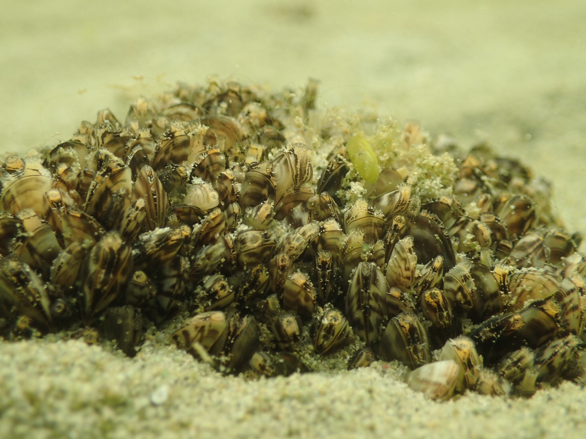

  
## Background
```{r, out.width="95%", fig.align = "center", echo=F}

```
\footnotesize \textcolor{gray}{photo: Naomi Blinick}

## Reliably count zebra mussels at low densities

\begincols
  \begincol{.38\textwidth}
```{r, out.width="100%", fig.align = "center", echo=F}
knitr::include_graphics("../Figures/IMG_2591.JPG")
```
\footnotesize \textcolor{gray}{photo: Naomi Blinick}
  \endcol
\begincol{.68\textwidth}
\begin{itemize}
\item Assess control efficacy
\item Determine conditions that promote growth
\end{itemize}
  \endcol
\endcols


## Benefits of using a formal survey design

\begincols
  \begincol{.38\textwidth}
```{r, out.width="100%", fig.align = "center", echo=F}

```

  \endcol
\begincol{.68\textwidth}
\begin{itemize}
\item Ensure sample is representative of the population
\item Control the amount of area surveyed
  \begin{itemize}
  \item Determine \textbf{uncertainty} in density
  \end{itemize}
\end{itemize}
  \endcol
\endcols

 
  
## Distance sampling
```{r, out.width="100%", fig.align = "center", echo=F}
knitr::include_graphics("../Figures/AustenDistance.png")
```
 \footnotesize \textcolor{gray}{image: Thomas Ostendorf}
 
## An approach for low and intermediate densities

```{r, out.width="60%", fig.align = "center", echo=F}
knitr::include_graphics("../Figures/DistanceSampling.png")
```

## Lake survey: summer 2017

```{r, out.width="65%", fig.align = "center", echo=F}
knitr::include_graphics("../Figures/Fig1_Burgan.pdf")
```

## Distance and detectability

```{r, out.width = "65%", fig.align = "center", echo=F}
knitr::include_graphics("../Figures/Fig3_Burgan.pdf")
```


## The payoff
${\color{red} X}$: is the number of zebra mussels detected

$\color{blue} A$: is the amount of are surveyed

$\color{orange} P$: is the detection probability of detecting a zebra mussel ($P = 0.60$)

- Observed density: $\frac{\color{red}X}{\color{blue}A} = 0.08$

- Estimated density: $\frac{\color{red}X}{\color{orange}P\,\color{blue}A} = 0.25$ (SE =$0.09)$


## Investigating survey tradeoffs

```{r, echo=F, warning=F, message=F}
library(MASS)
library(dplyr)
library(ggplot2)
library(gridExtra)
library(kableExtra)
library(RColorBrewer)
library(wesanderson)

load('../Writing/DensEst.Rdata')
load('../Writing/TimeBudgetEst.Rdata')
```

```{r, out.width="100%", fig.align = "center", echo=F}

```
 \footnotesize \textcolor{gray}{image: Thomas Ostendorf}
 
## The fast/slow tradeoff

Should we go fast and cover lots of area, but maybe miss some mussels?

**or**

Should we go slow and detect everything, but cover less area?

```{r, out.width = "60%", fig.align = "center", echo=F}

```

\footnotesize \textcolor{gray}{image: minutephysics(youtube.com)}

## Controlling effort through design

```{r, out.width = "80%", fig.align = "center", echo=F}
knitr::include_graphics("../Figures/DistanceQuadratSampling.png")
```


## Lake surveys: summer 2018

```{r, out.width = "100%", fig.align="center", echo=F}
knitr::include_graphics("../Figures/Fig1_Lakes.png")
```

## Time budget approach

- Time to **setup** each transect
- Time to conduct each **survey**
- Time to **move** between transects

```{r, out.width = "80%", fig.align = "center", echo=F}

```


## Time to perform transect setup & search

```{r, echo=F, out.width="100%", fig.asp=0.4}
surveyTypeCols <- wes_palette("Darjeeling1")

p1 <- ggplot(subset(length.pred, Type=="Setup time"), aes(x, predicted/60, group=group, colour=group)) + geom_line() + geom_ribbon(aes(ymin = conf.low/60, ymax = conf.high/60, fill=group), alpha = .1, colour=NA) + theme_classic() + labs(x="Transect distance", y="Time (minutes)", title="Setup time") + theme(legend.position="none") + scale_fill_manual(values=surveyTypeCols) + scale_colour_manual(values=surveyTypeCols) + theme(plot.title = element_text(hjust = 0.5), text=element_text(size=16), panel.spacing = unit(2, "lines")) 

p2 <- ggplot(subset(length.pred, Type=="Encounter time"), aes(x, predicted/60, group=group, colour=group)) + geom_line() + geom_ribbon(aes(ymin = conf.low/60, ymax = conf.high/60, fill=group), alpha = .1, colour=NA) + theme_classic() + labs(x="Transect distance", y="", title="Search time") + theme(legend.position="none") + scale_fill_manual(values=surveyTypeCols) + scale_colour_manual(values=surveyTypeCols) + theme(plot.title = element_text(hjust = 0.5), text=element_text(size=16), panel.spacing = unit(2, "lines")) 

p3 <- ggplot(rate.pred, aes(x, predicted/60, group=group, color=group)) + geom_line() + geom_ribbon(aes(ymin = conf.low/60, ymax = conf.high/60, fill=group), alpha = .1, colour=NA) + theme_classic() + labs(x="Detection rate", y="", title="Search time") + scale_fill_manual(values=surveyTypeCols) + scale_colour_manual(values=surveyTypeCols) + theme(plot.title = element_text(hjust = 0.5), text=element_text(size=16), panel.spacing = unit(2, "lines")) 

grid.arrange(p1, p2, p3, nrow=1, ncol=3, widths=c(8, 8, 12))

```


## Number of transects that can be completed

```{r, echo=F, out.width="100%", fig.asp=0.4, fig.align="center"}

ggplot(totalTime.df, aes(y=N, x=Time/60^2, colour=Design)) + geom_line(size=1.5) + facet_wrap(~Lake, ncol=3, scale="free_x") + theme_classic() + scale_fill_manual(values=surveyTypeCols) + scale_colour_manual(values=surveyTypeCols) + labs(y="Number of transects", x="Total survey time (hours)") + theme(legend.title=element_blank(), text=element_text(size=20), panel.spacing = unit(2, "lines")) 

```


## Impacts of the time budget on estimates
```{r, echo=F, out.width="100%", fig.asp=0.4, fig.align="center"}

totalPrec.df <- totalTime.df
origN.vec    <- c(rep(15, 30), rep(15, 30), rep(4, 15), rep(15, 15))
origSE.vec   <- c(rep(LF.distance.est$Dhat.se, 15), rep(LF.quadrat.est$Dhat.se, 15), rep(LB.distance.est$Dhat.se, 15), rep(LB.quadrat.est$Dhat.se, 15), rep(LBL.distance.est$Dhat.se, 15), rep(LBL.quadrat.est$Dhat.se, 15))
origCV.vec   <- c(rep(LF.distance.est$Dhat.se/LF.distance.est$Dhat, 15), rep(LF.quadrat.est$Dhat.se/LF.quadrat.est$Dhat, 15), rep(LB.distance.est$Dhat.se/LB.distance.est$Dhat, 15), rep(LB.quadrat.est$Dhat.se/LB.quadrat.est$Dhat, 15), rep(LBL.distance.est$Dhat.se/LBL.distance.est$Dhat, 15), rep(LBL.quadrat.est$Dhat.se/LBL.quadrat.est$Dhat, 15))

totalPrec.df <- totalPrec.df %>% mutate(SE=origSE.vec*sqrt(origN.vec/N), CV=origCV.vec*sqrt(origCV.vec/N))

ggplot(totalPrec.df, aes(x=Time/60^2, y=CV, colour=Design)) + geom_line(size=1.5) + facet_wrap(~Lake, ncol=3, scale="free_x") + theme_classic() + scale_fill_manual(values=surveyTypeCols) + scale_colour_manual(values=surveyTypeCols) + labs(x="Time (hours)", y=expression(paste("Density precision ", group("(", hat(sigma)/hat(D), ")"))) ) + theme(legend.title=element_blank(), text=element_text(size=20), panel.spacing = unit(2, "lines")) 

```


## Conclusions

\begin{itemize}
\item \textbf{Distance sampling} is an attractive approach at low-densities
\begin{itemize}
\item Requires two observers
\end{itemize}
\item At higher densities \textbf{quadrat surveys} are more efficient
\item Still working on exploring how survey area and efficiency trade off more generally
\end{itemize}


## Acknowledgements

\begincols
  \begincol{.48\textwidth}

**Naomi Blinick**

**Leslie  Schroeder**

**Sarah Baker**

**Aislyn Keyes**

**Austin Hilding**

**Thomas Ostendorf**
  
**Kylie Cattoor**

**Keegan Lund**


  \endcol
\begincol{.48\textwidth}

John Fieberg

Michael McCartney

Steve McComas

Rich Rezanka 

Tom Jones
  \endcol
\endcols

```{r, out.width = "20%", fig.align="center", echo=F}
 
```

```{r, out.width = "35%", fig.align="center", echo=F}
knitr::include_graphics("../Figures/MAISRC_logo.png")
```

* Contact me: Jake Ferguson (jakeferg@umn.edu)


## Estimated detection function

```{r, out.width = "65%", fig.align = "center", echo=F}

```

## Time it takes to move between transects

```{r, echo=F, fig.align="center", out.width="60%", fig.asp=1}
lake.cols <- wes_palette("IsleofDogs1", 3)

par(mar=c(5.1, 6.1, 4.1, 2.1))
plot( nvec.cont, LF.predict/60, type='l', col=lake.cols[1], lwd=5, ylim=c(11, 18), ylab="Time to travel between sites (minutes)", xlab="Number of sites", cex.lab=2.5, cex.axis=2.5)
lines(nvec.cont, LB.predict/60, lwd=5, col=lake.cols[2])
lines(nvec.cont, LBL.predict/60, lwd=5, col=lake.cols[3])

legend('topright', lwd=5, col=lake.cols, legend=c("Lake Florida", "Lake Burgan", "Little Birch Lake"), cex=2.5)

```

